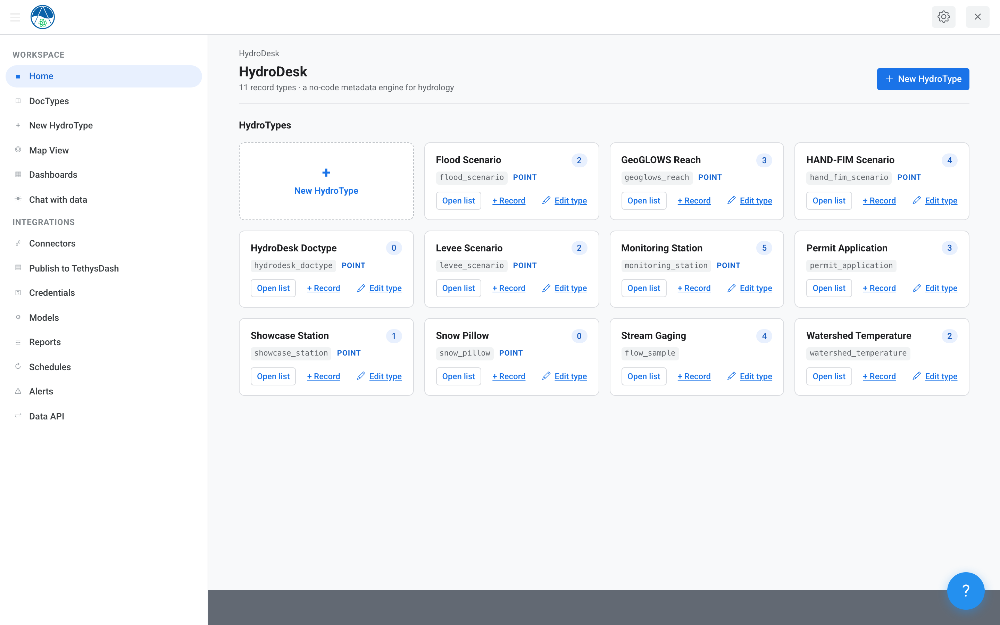
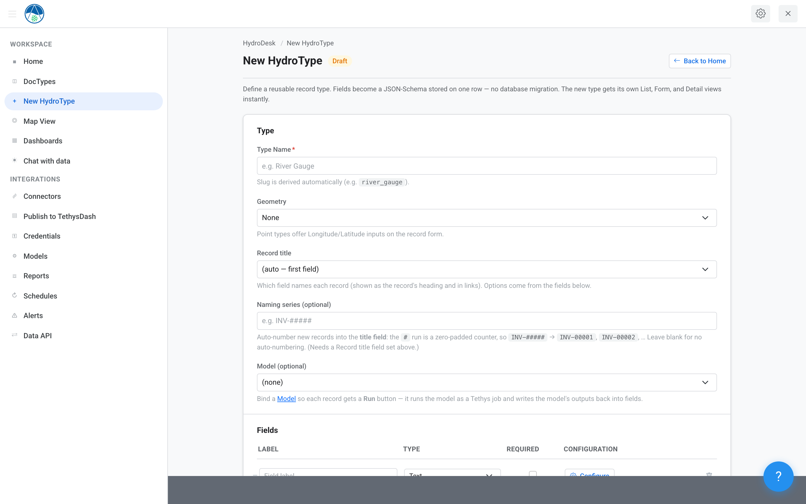
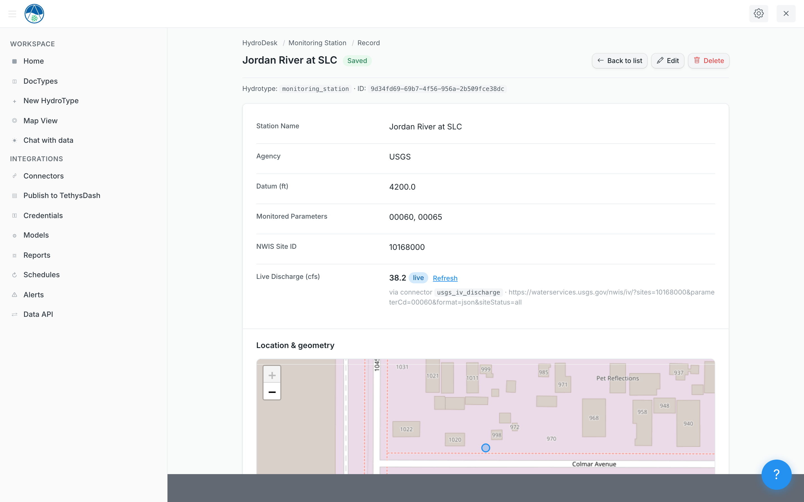
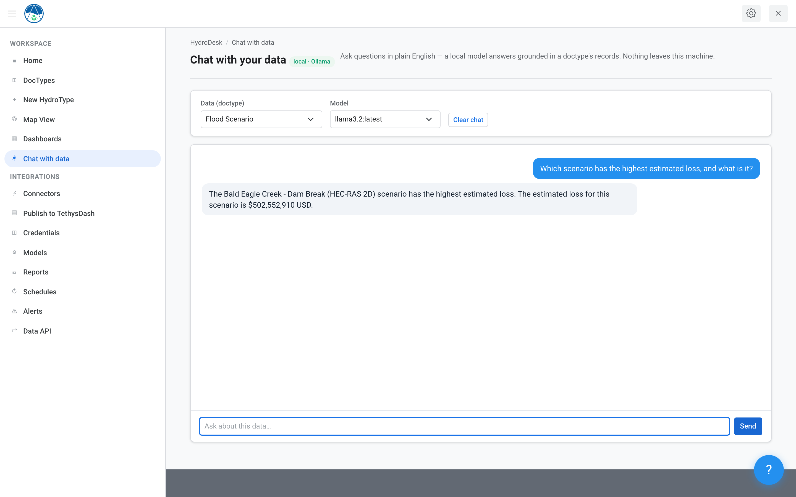
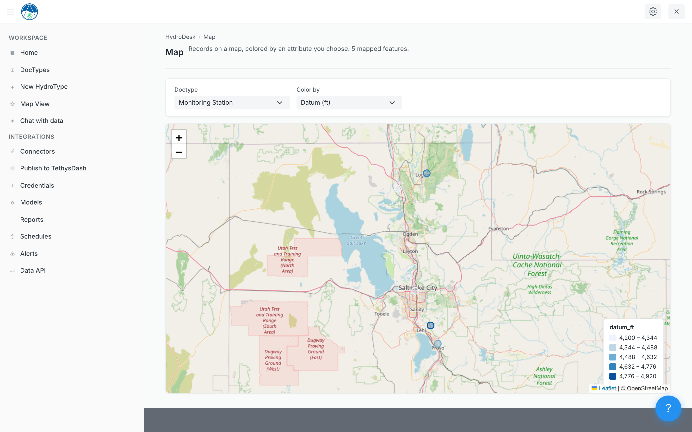
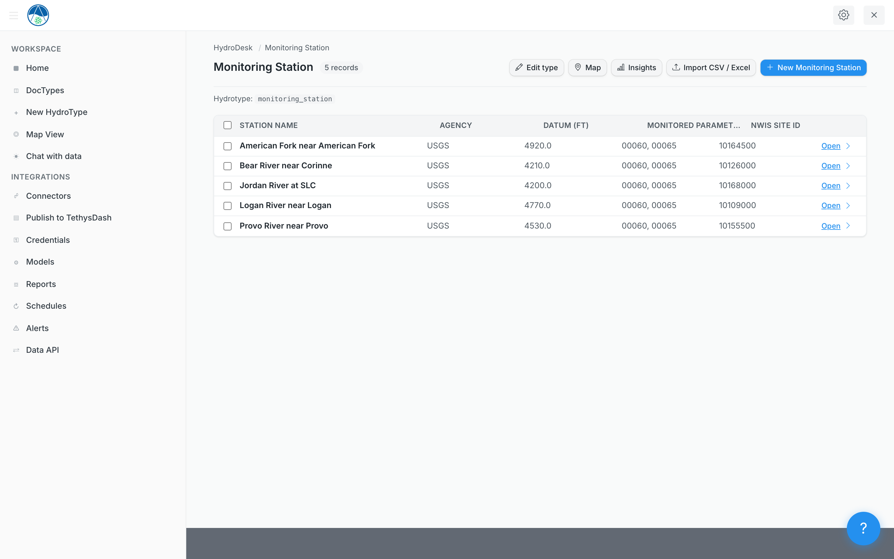
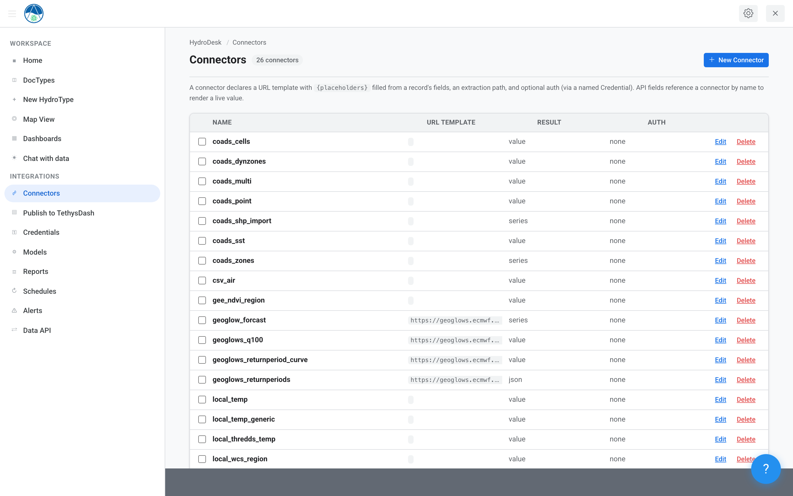
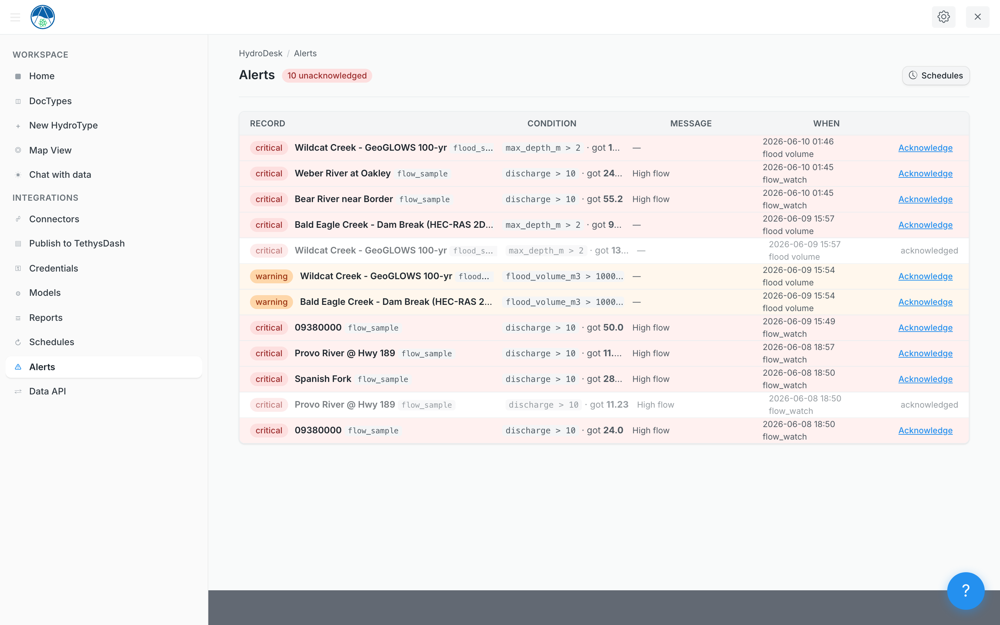
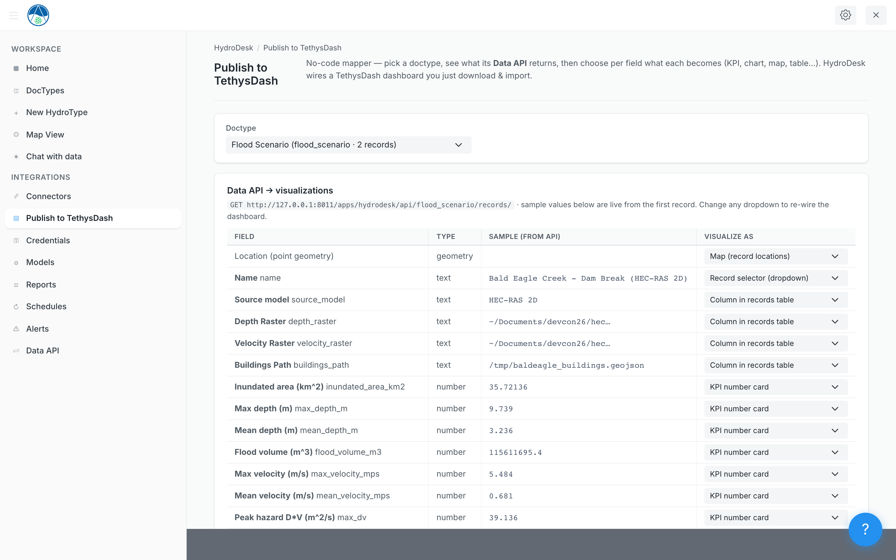
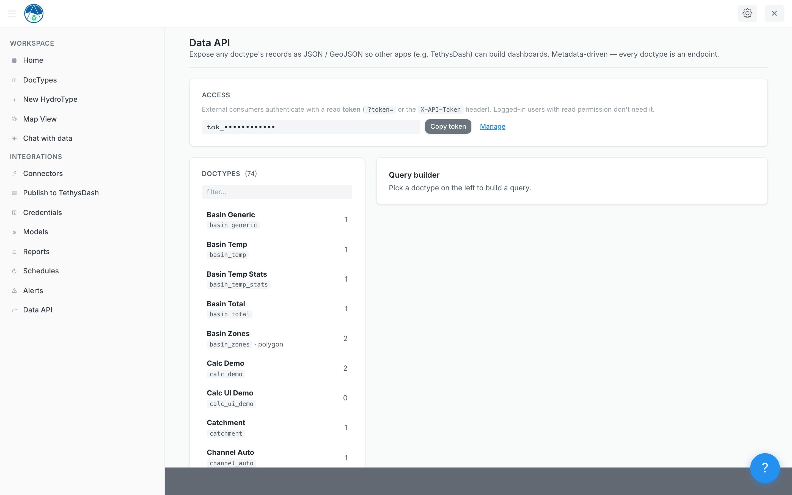

# HydroDesk

A **no-code metadata engine** for the [Tethys Platform](https://www.tethysplatform.org/) — so non-coding hydrologists (and anyone else) can build data-driven web apps **without writing code or running database migrations**.

Define a record type once in a visual builder, and HydroDesk instantly generates **List, Form, Detail, and Map** views, **live API integrations**, **computed Python models**, **scheduling & alerts**, **reports & dashboards**, a **REST data API**, and an **offline AI assistant** that can answer questions about your data *and build doctypes and connectors for you from plain English*.

> Packaged as the Tethys app `tethysapp-hydrodesk`; repo [`anomaitech/hydrodesk`](https://github.com/anomaitech/hydrodesk).



<p align="center"><em>The HydroDesk workspace — every record type you define gets instant List, Form, Detail, and Map views, plus live connectors and a built-in AI assistant.</em></p>

---

## Table of contents

- [Why HydroDesk](#why-hydrodesk)
- [Screenshots](#screenshots)
- [Core concept](#core-concept)
- [Features](#features)
  - [No-code DocType builder](#1-no-code-doctype-builder)
  - [Field types](#2-field-types)
  - [Auto-generated views & records](#3-auto-generated-views--records)
  - [Live data connectors](#4-live-data-connectors)
  - [Computed fields & models](#5-computed-fields--models)
  - [Scheduling & alerts](#6-scheduling--alerts)
  - [Reports, insights & maps](#7-reports-insights--maps)
  - [Data API & interoperability](#8-data-api--interoperability)
  - [Local AI assistant (offline)](#9-local-ai-assistant-offline)
- [Architecture](#architecture)
- [Installation](#installation)
- [Quick start](#quick-start)
- [Security model](#security-model)
- [Status & roadmap](#status--roadmap)
- [License](#license)

---

## Why HydroDesk

Most Tethys apps are written by developers: define a model, write controllers, build templates, run migrations, redeploy. HydroDesk inverts that. A **domain expert** describes *what they want to track* in a browser form, and the running app gains a new, fully-featured data type **with no code, no DDL, no `syncstores`, no restart**. New type = a single `INSERT`, not a schema change.

It's no-code, spreadsheet-simple ergonomics, purpose-built for **water & environmental data**: spatial-first (PostGIS), with first-class live connectors to USGS, NOAA, GeoGLOWS, NextGen/NGIAB, OPeNDAP/THREDDS, and OGC web services.

---

## Screenshots

<table>
<tr>
<td width="50%"><br><sub><b>No-code type builder</b> — define fields, geometry, the title field, and bind a model. No code, no migrations.</sub></td>
<td width="50%"><br><sub><b>Live data in a record</b> — a Monitoring Station pulling real-time USGS discharge (38.2 cfs) on its detail page.</sub></td>
</tr>
<tr>
<td width="50%"><br><sub><b>Chat with your data</b> — a local Ollama model answers grounded in your records. Nothing leaves the machine.</sub></td>
<td width="50%"><br><sub><b>Map view</b> — any spatial type rendered on a map, colored by an attribute you choose.</sub></td>
</tr>
<tr>
<td width="50%"><br><sub><b>Auto-generated list</b> — sortable table with one-click Insights, Map, and CSV/Excel import.</sub></td>
<td width="50%"><br><sub><b>Connectors</b> — reusable live-data sources (USGS, GeoGLOWS, OPeNDAP/THREDDS, OGC, GEE…) with a Test panel.</sub></td>
</tr>
<tr>
<td width="50%"><br><sub><b>Threshold alerts</b> — breaches across records with severity, the triggering condition, and one-click acknowledge (email-capable).</sub></td>
<td width="50%"><br><sub><b>Publish to TethysDash</b> — map each field to a KPI, chart, map, or table, then download an import-ready dashboard.</sub></td>
</tr>
<tr>
<td colspan="2"><br><sub><b>Data API</b> — every doctype is a JSON / GeoJSON endpoint, with a read token and a point-and-click query builder.</sub></td>
</tr>
</table>

---

## Core concept

Everything is driven by one definition: a **HydroType** (the "DocType").

| Object | Role |
|---|---|
| **HydroType** | The type definition. Stored as a JSON-Schema `field_schema` with `x-` extension keys (widgets, links, connectors, child tables, layout). |
| **HydroRecord** | A record of any type. Field values live in a JSONB column; geometry lives in a shared PostGIS column. |
| **HydroConnector / HydroCredential** | Reusable live-data integrations and the named secrets they authenticate with. |

A single generic store (`hydrotype` + `hydro_record`, with a GIN index on the JSONB and a GiST index on geometry) backs **every** type — so adding a type never touches the database schema. Records are validated against their type's `field_schema` (`fastjsonschema`) on write.

---

## Features

### 1. No-code DocType builder

- **Visual field builder** — add fields, pick types, set options, reorder, mark required, set the title field.
- **Runtime types, zero migrations** — create / **edit** / **delete** a type and **delete individual fields** live; existing records adapt.
- **Duplicate a type** to fork a starting point.
- **DocTypes admin** with bulk-delete and a **hide** toggle (`x-hidden`) to keep scratch types out of the main UI without deleting them.
- **Layout controls** — Section / Column / Tab breaks group fields into a clean form.

### 2. Field types

A rich palette, all configured without code:

| Group | Types |
|---|---|
| **Text** | Text, Long Text, Email, URL, Phone, Tags, Select, Color |
| **Numeric** | Number, Integer, Currency, Percent, Duration, Rating, List (numbers) |
| **Temporal / boolean** | Date, Checkbox |
| **Relational** | **Link** (foreign key to another type), **Table** (child grid: inline rows *or* linked records of another type) |
| **Spatial** | **Point**, **Line**, **Polygon** (draw on a map), **Shapefile** (upload) |
| **Live / computed** | **API** (live external data via a connector), **Formula** (computed expression), **Python Script** (computed, sandboxed) |
| **Layout** | Section Break, Column Break, Tab Break |

### 3. Auto-generated views & records

Every type automatically gets:

- **List** view — sortable/filterable table, with **Insights**, **Map**, and **Import** shortcuts.
- **Form** view — new/edit, including **draw-on-map** geometry capture (Leaflet + Leaflet.draw) and child-table editing.
- **Detail** view — per-record page that renders live connector data, model outputs, linked tables, and series charts.
- **Map** view — for spatial types.

Plus full record lifecycle: per-record CRUD, **bulk-delete** with select-all, **link existing** records into a child table, and **CSV / Excel import** (`.csv`, `.xlsx`, `.xlsm`) with type coercion (dates → ISO, whole floats → ints).

### 4. Live data connectors

A configurable integration engine — no glue code. A **connector** is a reusable, named data source; a doctype's **API field** binds to one and maps record fields to its inputs.

**Connector kinds (7):**

| Kind | What it fetches |
|---|---|
| `rest` | JSON/XML REST APIs via a URL template |
| `csv` | Remote or local CSV tables (with header / column selection) |
| `netcdf` | NetCDF over **OPeNDAP** (variable + dimensions) |
| `thredds` | **THREDDS** catalogs (siphon → OPeNDAP) |
| `wms` | OGC **WMS** map images |
| `wcs` | OGC **WCS** coverages / rasters |
| `gee` | **Google Earth Engine** assets (asset + band + reducer) |

**One-click presets** for common water-data sources: **USGS NWIS** Instantaneous & Daily Values, **NOAA NWPS** gauge stage/flow, **Water Quality Portal**, **GeoGLOWS** 15-day forecast, **NextGen / NGIAB** nexus output, plus generic REST/CSV/OPeNDAP/THREDDS/WMS/WCS/GEE templates.

**Connector authoring includes:**

- **Sourced inputs** — each input resolves from a record field, a constant, a runtime value, or a secret (with per-doctype remapping via `x-api-map`).
- **Output catalog** — pick which value(s) to extract: Number, Text, Date, **Time-Series**, or **Image**. Series render as a multi-column table and as charts.
- **Test panel** — run the connector live and pick output paths from a **clickable JSON tree**; describe NetCDF/THREDDS/WMS/WCS/GEE datasets to discover variables/layers/coverages.
- **Auth via credentials** — API-key, bearer, or basic, backed by a **named secret store** (`HydroCredential`). Secrets live only there, are never echoed, and never travel in exports.
- **Caching** — per-connector TTL so detail pages stay fast.

### 5. Computed fields & models

- **Formula fields** — quick computed expressions.
- **Python Script fields** & **Models** — write Python that consumes record fields and assigns named outputs (Number, Text, Date, Time-Series, JSON). Runs in a **sandboxed runner** (numpy / pandas / math / statistics available; no file/network/OS access).
- **Model runner + Job Manager** — execute a model against a record, track job status, and **store outputs back into the record** (permanently, e.g. series as data-URIs). Auto-detect a script's outputs from its code.

### 6. Scheduling & alerts

- **Scheduled connectors** — refresh live data on a cadence.
- **Threshold alerts** — define breach conditions; HydroDesk records breaches and can **send email notifications** (`notify_email`) when thresholds are crossed.
- **Alerts inbox** — review and **acknowledge** alerts.

### 7. Reports, insights & maps

- **Report builder** — filter, group, and aggregate records (including across child-table columns), then export **CSV**.
- **Insights** — auto-generated stat cards and inline-SVG charts per doctype.
- **Styled map** — color-by-field GeoJSON maps (Leaflet) of any spatial type.

### 8. Data API & interoperability

- **REST data API** — `GET /api/{slug}/records` returns records as JSON, with `?include=` to materialize live connector values (series/scalars/images) and `?name=`/field filters. A catalog endpoint lists available types.
- **Read tokens** — a global read token gates programmatic access (see [Security model](#security-model)).
- **Portable export/import** — export a doctype (and optionally its data) as **JSON** and re-import elsewhere. Secrets never travel.
- **Publish to TethysDash** — a per-field visualization mapper emits **import-ready TethysDash dashboards** (charts for series connectors, tables for value connectors), downloadable as JSON.
- **JSON feeds** — `types.json`, `connectors.json`, `models.json` for tooling.

### 9. Local AI assistant (offline)

A complete, **local-only** AI layer powered by [Ollama](https://ollama.com/) — nothing leaves your machine.

- **💬 Chat with your data** — pick a doctype + a local model and ask in plain English; answers are **grounded in that doctype's actual records**.
- **❓ In-app guide (clicky-style)** — ask "how do I…?" and the assistant **answers, highlights the right button, offers a "Take me there →" action, and can speak the answer** (offline browser TTS). Web-native, so it needs no screen capture.
- **🛠 AI code-gen** — describe a calculation and a local code model writes the runnable Python body for a script field or model (syntax-checked).
- **🏗 AI builds a DocType** — *"create a Snow Pillow with site name, SWE inches, elevation, install date, status Active/Inactive"* → the doctype is designed and **created**, with the right field types and geometry.
- **🔌 AI builds a Connector** — *"connect to USGS instantaneous discharge for site 10163000"* → a working connector is **created** by matching a verified preset (or any pasted REST URL), with IDs auto-filled.
- **🧩 Compound build** — *"create a doctype with a GeoGLOWS reach 710833461 connector"* → builds a doctype **with a live forecast field wired to the connector** and seeds a starter record so the forecast renders immediately.

> The AI builders are admin-gated and prefer fast local models (e.g. `llama3.2` for design, `deepseek-coder-v2` for code). If Ollama isn't running, the rest of the app is unaffected.

---

## Architecture

| Path | Role |
|---|---|
| `tethysapp/hydrodesk/model.py` | Generic JSONB/PostGIS store — `HydroType`, `HydroRecord`, `HydroTimeseries`, `HydroConnector`, `HydroCredential`, plus model / schedule / alert / audit tables |
| `tethysapp/hydrodesk/controllers.py` | Metadata-driven controllers: builder, CRUD, list/detail/map render, the connector fetch engine, models, schedules, reports, the Data API, TethysDash publishing, and all AI endpoints |
| `tethysapp/hydrodesk/registry.py` | Export / import a doctype as portable JSON |
| `tethysapp/hydrodesk/templates/` | Clean, server-rendered UI |
| `tethysapp/hydrodesk/app.py` | Tethys app config + the single spatial persistent store `hydro_db` |

A HydroType is a JSON-Schema `field_schema` with `x-` extension keys for widgets, links, API connectors, child tables, and layout. Records validate against it and store values as JSONB — so adding a type is an `INSERT`, not a schema change.

---

## Installation

### Prerequisites

- A working **Tethys Platform** environment (Tethys **4.5+**).
- A **PostgreSQL + PostGIS** persistent-store service (the store is spatial).
- *(Optional)* **[Ollama](https://ollama.com/)** for the AI features.

### Install the app

```bash
# from within your activated Tethys conda environment, in the repo root
tethys install -d
```

### Provision the spatial persistent store

Create/assign a **spatial** persistent-store service in the Tethys portal (Site Admin → Tethys Services), link it to this app's `hydro_db` setting, then sync:

```bash
tethys link persistent:<your_pg_service> hydrodesk:ps_database:hydro_db
tethys syncstores hydrodesk
```

### Start

```bash
tethys manage start          # then open /apps/hydrodesk/
```

### Optional dependencies (per connector kind)

Install only what you need:

| For… | Install |
|---|---|
| Excel import | `openpyxl` |
| NetCDF / OPeNDAP | `xarray netCDF4 pydap` |
| THREDDS catalogs | `siphon` |
| WMS / WCS | `OWSLib` |
| Google Earth Engine | `earthengine-api` (plus a configured GEE credential) |
| Script fields / models | `numpy pandas` |

REST/CSV connectors use `requests`, which is already present in a Tethys environment.

### Enable the local AI (optional)

```bash
# install Ollama (https://ollama.com), then pull the models HydroDesk prefers:
ollama pull llama3.2            # fast designer + chat (default)
ollama pull deepseek-coder-v2   # code generation
# HydroDesk talks to Ollama at http://localhost:11434
```

---

## Quick start

1. Open `/apps/hydrodesk/` and click **New HydroType** (or ask the **AI guide** to build one).
2. Add fields — e.g. a **Point** geometry for stations, a **Select** for status, an **API** field for live data.
3. Save — your type now has List / Form / Detail / Map views.
4. Add records (or **Import CSV/Excel**, or **draw geometry** on the map).
5. *(Optional)* Build a **Connector** (USGS, GeoGLOWS, NextGen…), bind it to your API field, and watch live data render on the detail page.
6. *(Optional)* Add a **Model** to compute outputs, a **Schedule** to refresh data, an **Alert** for thresholds, or **Publish to TethysDash**.

---

## Security model

- **Builder-gated authoring** — creating/editing doctypes, connectors, credentials, and models is restricted to staff/superusers (`_can_build`). Models run **trusted/unsandboxed at the Python level by design**, so only admins may define them.
- **Secrets stay secret** — credentials live in a dedicated `HydroCredential` store, are **never echoed** back to the UI or test flow, and **never appear in exports**. Doctypes/connectors reference secrets by **name** only.
- **API read token** — the Data API read token is a **global** token that bypasses per-doctype permissions by design; treat it as a shared read credential.
- **Local-only AI** — every AI feature calls a local Ollama instance; **no data is sent to any external service.**

---

## Status & roadmap

**Active development.**

Ideas on deck: introspect-then-pick AI builders for geospatial connector kinds (WMS/NetCDF), credential-aware freeform connectors, and richer voice input (local Whisper).

---

## License

See repository license. Built on the [Tethys Platform](https://www.tethysplatform.org/).
